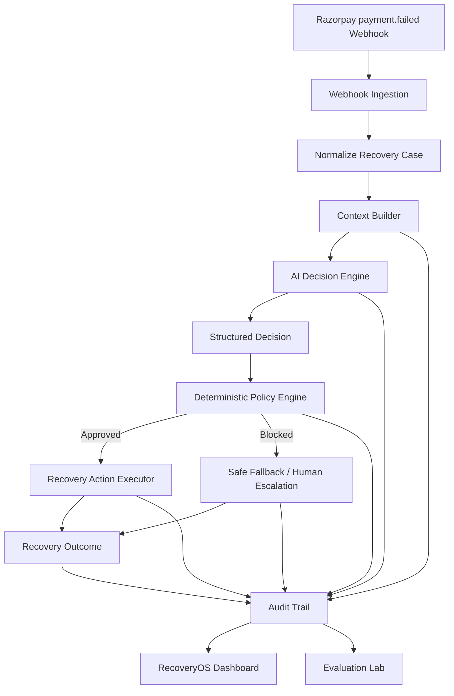

# RecoveryOS

### Bounded AI Revenue Recovery for Razorpay

RecoveryOS is a policy-governed revenue recovery system that determines the safest next intervention for failed or at-risk payments.

Instead of blindly retrying every failed payment, RecoveryOS evaluates payment context, proposes a recovery action, validates that action against deterministic policies, executes only permitted actions, and records the complete decision trace.

> **AI decides what should happen. Policies decide what may happen.**

RecoveryOS was built for the **Razorpay AI Buildathon 2026 — AI Revenue Recovery track**.

---

## 🌐 Live Demo

**RecoveryOS is deployed and publicly accessible on Vercel:**

👉 https://recovery-os-zeta.vercel.app

> Explore the recovery dashboard, case-level decision traces, policy guardrails,
> human escalations, audit trail, and deterministic evaluation benchmark.

## The Problem

A failed payment does not always mean:

> "Retry the payment."

Different failures require different recovery strategies.

Examples:

- Temporary gateway failure → retry may work
- Expired card → request payment-method update
- Insufficient funds → retry later
- Repeated failures → stop retrying or escalate
- Overdue invoice → payment link or promise-to-pay
- Ambiguous or risky case → human review

Blind retry systems can create:

- unnecessary payment attempts
- customer friction
- repeated failures
- higher operational cost
- unsafe autonomous behavior

RecoveryOS treats revenue recovery as a **bounded decision problem**, not simply a retry scheduler.

---

# Core Recovery Loop

```text
DETECT
   ↓
DIAGNOSE
   ↓
DECIDE
   ↓
VALIDATE
   ↓
EXECUTE
   ↓
OBSERVE
   ↓
AUDIT
```

Every recovery case passes through the same controlled pipeline.

The AI is responsible for proposing what should happen.

The deterministic policy layer decides whether that proposal is actually allowed to happen.

---

# Architecture



### Separation of responsibilities

RecoveryOS deliberately separates reasoning, governance and execution.

```text
Payment Event
     │
     ▼
Context Builder
     │
     ▼
AI Decision Engine
     │
     │ proposes
     ▼
Policy Engine
     │
     ├── Approved ──────► Action Executor
     │
     └── Blocked ───────► Safe Fallback / Human Review
                              │
                              ▼
                         Audit Trail
```

The AI never directly controls payment execution.

---

# Recovery Actions

RecoveryOS currently supports the following bounded action space:

| Action | Purpose |
|---|---|
| `RETRY_NOW` | Retry when failure appears temporary |
| `RETRY_LATER` | Delay recovery until conditions are more favorable |
| `UPDATE_PAYMENT_METHOD` | Ask the customer to replace an invalid or expired payment method |
| `SEND_PAYMENT_LINK` | Provide another path for completing payment |
| `PROMISE_TO_PAY` | Record a future payment commitment |
| `ESCALATE_TO_HUMAN` | Route uncertain or sensitive cases for manual review |
| `STOP_RECOVERY` | Stop automated recovery when continuing is unsafe or wasteful |

Restricting the action space keeps autonomous behavior inspectable and controllable.

---

# Example: A Policy Prevents an Unsafe Retry

Consider recovery case `RC_002`.

```text
Amount: ₹4,999
Failure: INSUFFICIENT_FUNDS
Previous recovery attempts: 3
```

The decision engine proposes:

```json
{
  "action": "RETRY_LATER",
  "confidence": 0.89,
  "delayHours": 48
}
```

But the deterministic policy engine detects:

```text
MAX_RETRY_LIMIT_REACHED
```

Therefore:

```text
AI Proposal
     ↓
RETRY_LATER

Policy Engine
     ↓
BLOCKED

Safe Fallback
     ↓
ESCALATE_TO_HUMAN
```

The AI proposal never silently becomes an executed action.

This demonstrates the central RecoveryOS principle:

> **AI decides what should happen. Policies decide what may happen.**

---

# Policy Guardrails

RecoveryOS places deterministic guardrails between AI reasoning and execution.

Examples include:

### Retry limits

Repeated recovery attempts eventually stop being useful and can increase customer friction.

RecoveryOS can block additional retries once the configured retry limit has been reached.

### Retry cooldown

A retry can be rejected when insufficient time has passed since the previous attempt.

Instead of immediately retrying, the policy layer can schedule a safer delayed action.

### Hard-decline protection

Certain failure categories should not trigger repeated automated retries.

The policy engine can prevent inappropriate recovery actions for those cases.

### Confidence thresholds

Low-confidence AI decisions can be routed to a safer fallback instead of being executed autonomously.

### Human review

Cases that are ambiguous, sensitive or outside safe automation boundaries can be escalated.

### Safe fallback actions

A blocked AI decision does not mean the workflow simply fails.

The policy engine can select a bounded fallback such as:

```text
RETRY_LATER
ESCALATE_TO_HUMAN
STOP_RECOVERY
```

---

# Human-in-the-Loop

RecoveryOS does not assume every revenue recovery decision should be autonomous.

When deterministic policies identify an unsafe or uncertain action, the system can route the case to a human reviewer.

The **Escalations** interface exposes these cases separately so an operator can inspect:

- payment context
- AI recommendation
- confidence
- policy violations
- previous recovery attempts
- reason for escalation

This creates bounded autonomy rather than unrestricted automation.

---

# Razorpay Webhook Integration

RecoveryOS includes a Razorpay-compatible webhook ingestion endpoint:

```text
POST /api/webhooks/razorpay
```

The prototype accepts `payment.failed` events.

A Razorpay-style webhook payload is normalized into the internal `RecoveryCase` representation before entering the recovery pipeline.

Example flow:

```text
Razorpay payment.failed
        ↓
Webhook Endpoint
        ↓
Payload Normalization
        ↓
RecoveryCase
        ↓
Context Builder
        ↓
Decision Engine
        ↓
Policy Validation
        ↓
Execution / Fallback
        ↓
Audit Trail
```

This keeps Razorpay-specific event ingestion separate from RecoveryOS decision logic.

---

## Webhook Idempotency

Payment providers may deliver the same webhook more than once.

RecoveryOS therefore tracks the Razorpay event identifier:

```text
x-razorpay-event-id
```

When an already processed event is received again, RecoveryOS recognizes it as a duplicate instead of running the recovery workflow twice.

This prevents duplicate recovery actions from repeated webhook delivery.

---

## Webhook Signature Verification

The webhook endpoint contains support for signature verification when a webhook secret is configured.

For local demonstration without a configured secret, the response explicitly reports:

```json
{
  "signatureVerified": false
}
```

This is intentional and visible rather than silently claiming that an unsigned local request has been authenticated.

A production deployment should configure the Razorpay webhook secret and reject requests that fail signature verification.

---

# Decision Engine

RecoveryOS separates the **decision provider** from the rest of the recovery architecture.

The decision layer receives structured recovery context and produces a bounded recommendation containing fields such as:

```json
{
  "action": "RETRY_LATER",
  "confidence": 0.89,
  "reason": "The failure may be temporary and the customer may have funds available later.",
  "delayHours": 48
}
```

The decision is not trusted automatically.

It must still pass deterministic policy validation before execution.

This separation allows the reasoning provider to evolve without weakening the safety boundary around execution.

---

# Structured Decisions

RecoveryOS does not rely on free-form model text for execution.

Decisions follow a defined structure containing:

- recovery action
- confidence
- reasoning
- optional delay

Structured output makes decisions easier to:

- validate
- inspect
- audit
- compare
- pass into deterministic policies

This is especially important when AI output influences financial workflows.

---

# Explainability & Audit Trail

Every important stage of the recovery workflow is recorded.

Example events include:

```text
CASE_PROCESSING_STARTED
CONTEXT_BUILT
DECISION_GENERATED
POLICY_APPROVED
POLICY_BLOCKED
ACTION_EXECUTED
FALLBACK_EXECUTED
```

A typical successful trace looks like:

```text
CASE_PROCESSING_STARTED
        ↓
CONTEXT_BUILT
        ↓
DECISION_GENERATED
        ↓
POLICY_APPROVED
        ↓
ACTION_EXECUTED
```

A blocked trace looks like:

```text
CASE_PROCESSING_STARTED
        ↓
CONTEXT_BUILT
        ↓
DECISION_GENERATED
        ↓
POLICY_BLOCKED
        ↓
FALLBACK_EXECUTED
```

The **Audit Trail** interface makes these events inspectable.

This allows an operator to answer:

- What context did the system see?
- What did the decision engine propose?
- Why was the action selected?
- Did policy approve it?
- Was anything blocked?
- What finally executed?

The AI proposal and final execution are intentionally recorded separately.

---

# Evaluation

A revenue recovery system should not be judged only by whether it can produce decisions.

It should be compared against simpler strategies.

RecoveryOS therefore includes an **Evaluation Lab** that benchmarks three approaches:

### 1. Fixed Retry

A simple strategy that retries failed payments without using contextual recovery decisions.

### 2. Rule-Based Recovery

A stronger deterministic baseline that maps known failure categories to predefined recovery actions.

### 3. RecoveryOS

A context-aware decision strategy operating behind deterministic policy guardrails.

The benchmark measures both:

- **revenue recovery**
- **intervention safety**

---

## Current Synthetic Benchmark

The current prototype evaluates the strategies on a deterministic synthetic portfolio of:

```text
100 recovery cases
```

The Evaluation Lab currently displays metrics including:

- total at-risk portfolio
- simulated recovered revenue
- recovery rate
- unsafe actions prevented
- unnecessary retries
- human escalations
- strategy comparison

The current deterministic benchmark shown in the application includes an at-risk portfolio of:

```text
₹6,10,900
```

and compares Fixed Retry, Rule-Based Recovery and RecoveryOS across the same synthetic portfolio.

---

## Important Evaluation Disclaimer

**All benchmark cases and recovery outcomes in this prototype are synthetic simulations.**

The evaluation does **not** represent real Razorpay merchant revenue, real customer payment outcomes or production recovery performance.

The purpose of the benchmark is to provide a deterministic environment for comparing recovery strategies under identical scenarios.

This distinction is important:

```text
Prototype result ≠ production recovery claim
```

The benchmark demonstrates the architecture and evaluation methodology rather than claiming real-world revenue uplift.

---

# RecoveryOS Trade-Off

RecoveryOS intentionally does **not** optimize for:

> maximum revenue recovery at any cost.

An aggressive system could repeatedly retry payments and potentially show higher simulated recovery while also producing:

- more unnecessary attempts
- higher customer friction
- unsafe retry behavior
- fewer human reviews
- weaker governance

RecoveryOS instead optimizes for a balance between:

```text
Recovered Revenue
        +
Intervention Safety
        +
Bounded Autonomy
```

This trade-off is visible in the Evaluation Lab.

---

# Stopping Is a Feature

A recovery system should know when **not** to act.

RecoveryOS can stop or escalate recovery when continuing automation is no longer appropriate.

Examples include:

- retry limits exceeded
- hard decline
- low confidence
- repeated unsuccessful interventions
- ambiguous recovery context
- policy violation

Therefore:

> Doing nothing, waiting, or escalating can be the correct recovery decision.

---

# Product Interfaces

RecoveryOS includes five primary operational views.

### Recovery Dashboard

Provides an executive view of the current recovery workflow, including:

- at-risk revenue
- AI confidence
- attempts
- policy status
- active recovery case
- AI proposal
- policy decision
- final execution
- recovery insight

### Recovery Queue

Displays active recovery cases and their:

- amount
- failure reason
- proposed action
- confidence
- policy result
- execution result

Individual cases can be opened to inspect their complete decision trace.

### Escalations

Shows recovery cases requiring human intervention.

This makes human-in-the-loop behavior explicit rather than hiding uncertain decisions inside autonomous execution.

### Audit Trail

Provides an inspectable timeline of recovery events across cases.

### Evaluation Lab

Benchmarks recovery strategies on the same deterministic synthetic portfolio.

Together, these interfaces expose the complete lifecycle:

```text
Operational State
      ↓
Individual Case
      ↓
AI Decision
      ↓
Policy Enforcement
      ↓
Execution
      ↓
Auditability
      ↓
Evaluation
```

---

# API Endpoints

The prototype exposes endpoints including:

```text
GET  /api/recovery/demo
GET  /api/recovery/cases
GET  /api/evaluation
GET  /api/audit
POST /api/webhooks/razorpay
```

### `/api/recovery/demo`

Processes the flagship demonstration recovery case.

### `/api/recovery/cases`

Processes the synthetic recovery queue.

### `/api/evaluation`

Returns deterministic benchmark results for the Evaluation Lab.

### `/api/audit`

Returns the recovery decision audit events.

### `/api/webhooks/razorpay`

Accepts Razorpay-style `payment.failed` webhook events and sends normalized cases through the RecoveryOS pipeline.

---

# Project Structure

```text
RecoveryOS
│
├── app
│   ├── api
│   │   ├── audit
│   │   ├── evaluation
│   │   ├── recovery
│   │   └── webhooks
│   │
│   ├── audit-trail
│   ├── escalations
│   ├── evaluations
│   ├── recovery-queue
│   └── page.tsx
│
├── components
│   ├── dashboard
│   └── layout
│
├── lib
│   ├── ai
│   ├── audit
│   ├── evaluation
│   ├── policy
│   ├── recovery
│   └── tools
│
└── README.md
```

---

# Technology Stack

### Frontend

- Next.js
- React
- TypeScript
- Tailwind CSS
- Lucide React
- Recharts

### Backend

- Next.js Route Handlers
- TypeScript

### AI / Decision Layer

- structured recovery decisions
- bounded action schema
- confidence-based decision metadata
- provider-isolated decision architecture

### Safety

- deterministic policy engine
- retry limits
- cooldown enforcement
- safe fallbacks
- human escalation

### Payments Integration

- Razorpay-compatible `payment.failed` webhook ingestion
- webhook event normalization
- duplicate event protection
- signature-verification support

### Evaluation

- deterministic synthetic recovery dataset
- fixed-retry baseline
- rule-based baseline
- RecoveryOS strategy
- simulated outcome engine

---

# Running Locally

Clone the repository:

```bash
git clone https://github.com/AvniBamola/RecoveryOS.git
```

Enter the project:

```bash
cd RecoveryOS
```

Install dependencies:

```bash
npm install
```

Create the local environment file if required:

```bash
touch .env.local
```

Start the development server:

```bash
npm run dev
```

Open the application in your browser at:

```text
http://localhost:3000
```

---

# Environment Variables

Secrets must never be committed to Git.

Local configuration belongs in:

```text
.env.local
```

Depending on the configured decision provider and webhook setup, the application can use environment variables for:

```text
AI / model provider API key
Razorpay webhook secret
```

`.env.local` should remain excluded from version control.

---

# Example Razorpay Webhook Test

A Razorpay-style failed-payment event can be sent locally with:

```bash
curl -X POST http://localhost:3000/api/webhooks/razorpay \
  -H "Content-Type: application/json" \
  -H "x-razorpay-event-id: evt_recoveryos_demo_001" \
  -d '{
    "event": "payment.failed",
    "payload": {
      "payment": {
        "entity": {
          "id": "pay_rzp_demo_001",
          "amount": 499900,
          "currency": "INR",
          "method": "card",
          "error_code": "GATEWAY_ERROR",
          "error_description": "Payment failed because the gateway was temporarily unavailable.",
          "created_at": 1788460000
        }
      }
    }
  }'
```

RecoveryOS converts Razorpay's smallest currency unit into rupees and maps the payment failure into its internal recovery context.

The case then passes through the same:

```text
DECIDE → VALIDATE → EXECUTE → AUDIT
```

pipeline as every other recovery case.

---

# Prototype Limitations

RecoveryOS is a Buildathon prototype, not a production payment-recovery service.

Current limitations include:

- recovery outcomes are simulated
- benchmark data is synthetic
- action execution is simulated
- no real merchant money is moved
- no production customer communication is sent
- recovery history is prototype-scoped rather than backed by a production database
- webhook signature enforcement depends on configured local/deployment secrets
- production-grade authentication and authorization are outside the prototype scope
- production observability and distributed event infrastructure are not implemented

These limitations are intentionally stated rather than hidden behind demo behavior.

---

# Production Evolution

With additional development, RecoveryOS could evolve toward:

### Persistent recovery state

Store cases, attempts, outcomes and audit events in a durable database.

### Event-driven processing

Move recovery workflows to queues/workers for reliable asynchronous execution.

### Production Razorpay integration

Consume authenticated Razorpay webhooks and connect permitted recovery actions to test-mode/production-safe payment workflows.

### Merchant-specific policies

Allow merchants to configure:

- retry limits
- cooldowns
- escalation thresholds
- allowed actions
- communication limits
- amount thresholds

### Outcome learning

Use observed recovery outcomes to improve future intervention selection while keeping deterministic safety constraints outside the learning system.

### Stronger evaluation

Run offline evaluations against larger historical or anonymized datasets with:

- recovery uplift
- calibration
- intervention cost
- retry reduction
- customer-friction proxies
- policy violation rate

### Production governance

Add:

- role-based access control
- approval workflows
- policy versioning
- immutable audit storage
- model/version tracking
- monitoring and alerting

---

# Why RecoveryOS?

Most recovery approaches ask:

> **When should we retry?**

RecoveryOS asks a broader question:

> **What is the safest and highest-value intervention we are allowed to take next?**

That intervention might be:

```text
Retry Now
Retry Later
Update Payment Method
Send Payment Link
Promise To Pay
Escalate To Human
Stop Recovery
```

This turns payment recovery from a retry mechanism into a governed decision-and-execution system.

---

# Design Principles

RecoveryOS is built around five principles:

### 1. AI proposes — it does not directly execute

Reasoning and execution are separated.

### 2. Policies are deterministic

Safety-critical constraints should not depend on model persuasion or prompt wording.

### 3. Every action is explainable

Context, decision, policy result and execution are independently recorded.

### 4. Human escalation is a valid outcome

Autonomy should stop when confidence or policy boundaries require it.

### 5. Stopping is a feature

A safe recovery system must know when another intervention would create more harm than value.

---

# Core Principle

> ## AI decides what should happen. Policies decide what may happen.

RecoveryOS demonstrates how AI can participate in financial workflows without being given unrestricted authority over them.

The result is a recovery system designed around:

**revenue recovery + safety + explainability + bounded autonomy.**

---

## Built for Razorpay AI Buildathon 2026

**Track:** AI Revenue Recovery

**Project:** RecoveryOS

**Builder:** Avni Bamola